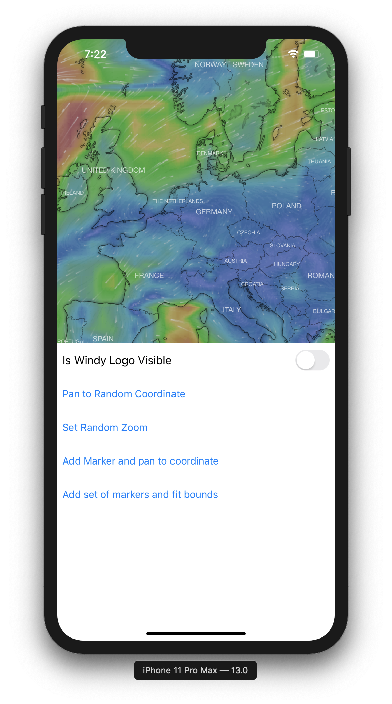
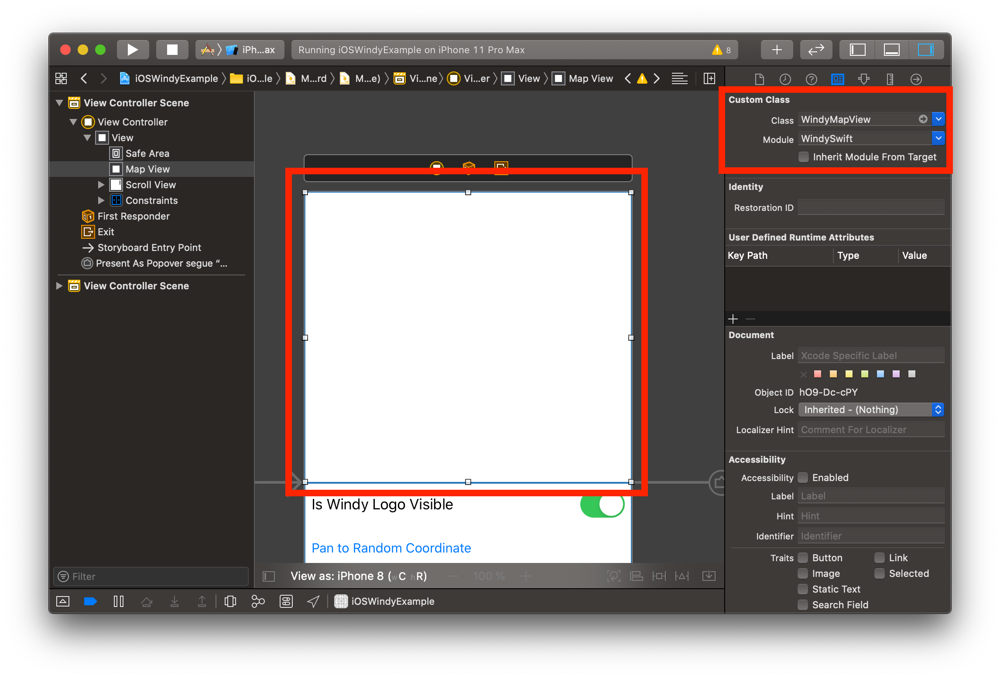

# WindySwift


[](https://github.com/thepeaklab/WindySwift/blob/master/LICENSE)
[](https://twitter.com/thepeaklab)

`WindySwift` is a wrapper for [windy.com](https://www.windy.com) written in Swift for the iOS and macOS platform.



## Usage

- Add `WindySwift` Swift Package to Xcode
- Add a `UIView` to your Storyboard and change the class to `WindyMapView`.



- Create an `@IBOutlet` in your ViewController

```swift
@IBOutlet var mapView: WindyMapView!
```

- Initialize your `WindyMapView` in `viewDidLoad()`

```swift
override func viewDidLoad() {
    super.viewDidLoad()

    mapView.delegate = self
    mapView.initialize(options: WindyInitOptions(key: "<YOUR Windy Key>",
                                                 lat: 53.1392144,
                                                 lon: 8.2057949,
                                                 zoom: 6))

}
```

### Region

#### Move center to coordinate

```swift
let randomLat = Double.random(in: 47...53)
let randomLng = Double.random(in: 7...12)
let coordinate = CLLocationCoordinate2D(latitude: randomLat, longitude: randomLng)
mapView.panTo(coordinate: coordinate, options: .animate(true))
```

#### Change zoom level

```swift
let zoomLevel = Int.random(in: 0...20)
mapView.setZoom(zoom: zoomLevel, options: .animate(true))
```

#### Fit Bounds

Fit the map, to that a list of coordinates are visible.

```swift
let coordinates = [
    CLLocationCoordinate2D(latitude: 53.528740, longitude: 8.452565),
    CLLocationCoordinate2D(latitude: 53.505438, longitude: 8.476923),
    CLLocationCoordinate2D(latitude: 53.488712, longitude: 8.410969),
    CLLocationCoordinate2D(latitude: 53.456613, longitude: 8.477863),
    CLLocationCoordinate2D(latitude: 53.449079, longitude: 8.425022),
    CLLocationCoordinate2D(latitude: 53.415919, longitude: 8.468630),
    CLLocationCoordinate2D(latitude: 53.406520, longitude: 8.394845)
]
mapView.fitBounds(coordinates: coordinates)
```

#### Get current map center coordinate

```swift
mapView.getCenter { coordinate in
    guard let coordinate = coordinate else {
        print("no center")
        return
    }
    print("center is at \(coordinate)")
}
```

#### Annotations

- Subclass `WindyMapAnnotation` to create custom annotation.

```swift
class CustomAnnotation: WindyMapAnnotation {

    init(coordinate: CLLocationCoordinate2D) {
        let mapIconRoratePath = Bundle.main.path(forResource: "sample", ofType: "gif")!
        super.init(coordinate: coordinate, icon: WindyIcon(icon: .url(url: mapIconRoratePath)))
    }

}
```

- Add Annotation

```swift
let coordinate = CLLocationCoordinate2D(latitude: 53.141063, longitude: 8.230920)
let annotation = RotateWindyAnnotation(coordinate: coordinate)
mapView.addAnnotation(annotation)
// or add multiple using addAnnotations(_ annotations: [WindyMapAnnotation])
```

- Implement Delegate

```swift
extension ViewController: WindyMapViewDelegate {

    func windyMapView(_ windyMapView: WindyMapView, viewFor annotation: WindyMapAnnotation) -> WindyMapAnnotationView? {
        switch annotation {
        case let customAnnotation as CustomAnnotation:
            let annotationView = WindyMapAnnotationView(annotation: customAnnotation, icon: customAnnotation.icon)
            return annotationView
        default:
            return nil
        }
    }

}
```

- Remove Annotation

```swift
// remove all annotations
mapView.removeAnnotations(mapView.annotations)

// or remove single annotation
removeAnnotation(_ annotation: WindyMapAnnotation)
```

- Convert annotation to center point (point center, not coordinate center)

```swift
windyMapView.convert(annotation) { point in
    print("annotation is at \(point)")
}
```

### WindyMapViewDelegate

```swift
func windyMapViewZoomDidInitialize(_ windyMapView: WindyMapView)

func windyMapViewZoomDidStart(_ windyMapView: WindyMapView)
func windyMapViewZoomDidEnd(_ windyMapView: WindyMapView)

func windyMapViewMoveDidStart(_ windyMapView: WindyMapView)
func windyMapViewMoveDidEnd(_ windyMapView: WindyMapView)

func windyMapViewDidZoom(_ windyMapView: WindyMapView)
func windyMapViewDidMove(_ windyMapView: WindyMapView)

func windyMapView(_ windyMapView: WindyMapView, viewFor: WindyMapAnnotation) -> WindyMapAnnotationView?

func windyMapView(_ windyMapView: WindyMapView, didSelect annotationView: WindyMapAnnotationView)
```

## Need Help?

Please [submit an issue](https://github.com/thepeaklab/WindySwift/issues) on GitHub.

## License

This project is licensed under the terms of the MIT license. See the [LICENSE](LICENSE) file.
